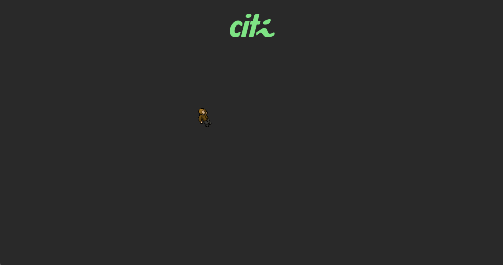

# Desafio Javascript

## PTA

    PTA é uma fase do processo seletivo do CITI, a qual ensinamos conhecimentos técnicos para aspirantes. Esse boilerplate foi criado para a subárea de desenvolvimento e tem o intuto de aproximar javascript às pessoas.

## Desafio 

    Ajude Pedro Queiroz! Perceba que Pedro queiroz foge da área da tela e isso faz com que ele se perca. Impeça que Pedro Queiroz ultrapasse a tela, implementando colisões na borda.

   

## Main.js

    Esse é o arquivo que você deve trabalhar. Comente o que cada linha de código está fazendo e caso não saiba, pesquise no Google. É nesse arquivo, também, que você deve implementar a colisão.

## Objetivos

- Comentários no arquivo main.js
- Colisões.

